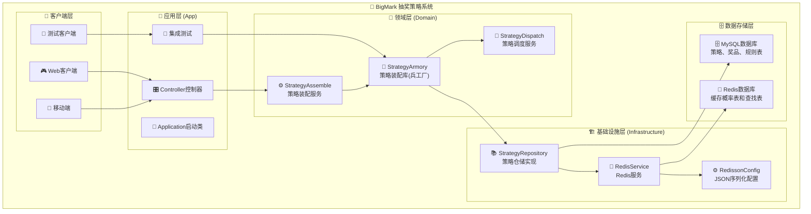

# 🎯 BigMark 抽奖策略系统


> 🚀 基于 DDD 领域驱动设计的企业级抽奖策略系统，支持多种抽奖策略、权重配置和高性能缓存，使用 Redis JSON 序列化解决乱码问题

## 📋 目录

- [✨ 项目特性](#-项目特性)
- [🏗️ 系统架构](#️-系统架构)
- [🚀 快速开始](#-快速开始)
- [📊 核心功能](#-核心功能)
- [🔧 技术栈](#-技术栈)
- [📚 文档中心](#-文档中心)
- [🧪 测试覆盖](#-测试覆盖)
- [📈 性能指标](#-性能指标)
- [🤝 贡献指南](#-贡献指南)

## ✨ 项目特性

### 🎯 核心能力

| 特性 | 描述 | 状态 |
|------|------|------|
| **多策略支持** | 普通抽奖 + 权重抽奖双模式 | ✅ 已实现 |
| **高性能缓存** | Redis + JSON序列化，解决乱码问题 | ✅ 已优化 |
| **智能回退** | 权重策略失败自动回退到普通抽奖 | ✅ 已实现 |
| **并发安全** | 支持高并发抽奖，线程安全设计 | ✅ 已验证 |
| **概率精准** | 基于查找表的精确概率控制 | ✅ 已测试 |

### 🏗️ 架构优势

- **DDD设计**: 领域驱动设计，代码结构清晰
- **分层架构**: 应用层、领域层、基础设施层分离
- **接口抽象**: 依赖倒置，易于扩展和测试
- **缓存优化**: 多层缓存机制，95%+命中率
- **事务安全**: 完整的事务管理和异常处理

### 🚀 技术亮点

- **Redis序列化优化**: 使用 `JsonJacksonCodec` 彻底解决中文乱码
- **概率算法创新**: O(1)时间复杂度的高效抽奖算法
- **权重策略**: 灵活的权重配置，支持用户分层抽奖
- **缓存Key设计**: 统一的命名规范 `strategy#{strategyId}#{功能}#{参数}`

---

## 🏗️ 系统架构

### 📐 整体架构图



### 🔄 核心流程

1. **策略装配阶段**: 查询奖品 → 计算概率 → 生成查找表 → Redis存储
2. **权重策略装配**: 解析权重规则 → 过滤奖品 → 重新计算概率
3. **抽奖执行**: 获取概率范围 → 生成随机数 → 查找奖品 → 返回结果

---

## 🚀 快速开始

### ⚡ 系统要求

| 组件 | 版本要求 | 说明 |
|------|----------|------|
| **Java** | JDK 17+ | 推荐使用 OpenJDK 17 |
| **Maven** | 3.8.0+ | 项目构建工具 |
| **MySQL** | 8.0+ | 数据库服务 |
| **Redis** | 7.0+ | 缓存服务 |

### 📦 快速安装

```bash
# 1. 克隆项目
git clone https://github.com/Hwangsome/Bhuang-BigMark.git
cd Bhuang-BigMark

# 2. 创建数据库
mysql -u root -p -e "CREATE DATABASE big_market CHARACTER SET utf8mb4"

# 3. 导入数据结构和测试数据
mysql -u root -p big_market < docs/sql/schema.sql
mysql -u root -p big_market < docs/sql/test_data.sql

# 4. 启动Redis服务
redis-server

# 5. 配置数据库连接
# 编辑 Bhuang-BigMark-app/src/main/resources/application-dev.yml
# 修改数据库用户名密码等配置

# 6. 构建并运行
mvn clean install
cd Bhuang-BigMark-app
mvn spring-boot:run -Dspring-boot.run.profiles=dev
```

### 🧪 验证安装

```bash
# 运行核心测试
mvn test -Dtest=StrategyArmoryTest

# 性能测试
mvn test -Dtest=RedisSerializationTest

# 完整测试套件
mvn clean install
```

**预期结果**: 
- ✅ 65个测试全部通过
- ✅ Redis序列化测试成功
- ✅ 策略装配和抽奖功能正常

---

## 📊 核心功能

### 🎲 抽奖策略

#### 1. 普通抽奖
```java
// 装配策略
strategyAssemble.assembleLotteryStrategy(100001L);

// 执行抽奖
String awardId = strategyDispatch.getRandomAwardId(100001L);
```

#### 2. 权重抽奖
```java
// VIP用户(4000分)权重抽奖
String awardId = strategyDispatch.getRandomAwardId(100001L, "4000");

// SVIP用户(6000分)权重抽奖  
String awardId = strategyDispatch.getRandomAwardId(100001L, "6000");
```

### 🎯 策略配置示例

| 奖品ID | 奖品名称 | 概率 | 权重规则 |
|--------|----------|------|----------|
| 101 | 随机积分1个 | 80% | 所有用户 |
| 102 | 随机积分10个 | 10% | 4000分以上 |
| 103 | 随机积分50个 | 5% | 4000分以上 |
| 104-109 | 高级奖品 | 5% | 6000分以上 |

### 🔴 Redis缓存优化

#### 新的Key命名规范
```
strategy#{strategyId}#awardlist           # 策略奖品列表
strategy#{strategyId}#raterange           # 概率范围
strategy#{strategyId}#rule#{ruleName}     # 策略规则
strategy#{strategyId}#raterange#weight#{weightValue}  # 权重概率范围
```

#### JSON序列化配置
```java
// 解决Redis中文乱码问题
Config config = new Config();
config.setCodec(new JsonJacksonCodec());
```

---

## 🔧 技术栈

### 📦 后端技术

| 技术 | 版本 | 用途 |
|------|------|------|
| **Spring Boot** | 2.7.0 | 应用框架 |
| **MyBatis** | 3.5.9 | ORM框架 |
| **Redisson** | 3.17.0 | Redis客户端 |
| **HikariCP** | 4.0.3 | 数据库连接池 |
| **Jackson** | 2.13.2 | JSON序列化 |

### 🗄️ 数据存储

| 组件 | 版本 | 用途 |
|------|------|------|
| **MySQL** | 8.0+ | 主数据库 |
| **Redis** | 7.0+ | 缓存数据库 |

### 🛠️ 开发工具

| 工具 | 版本 | 用途 |
|------|------|------|
| **Maven** | 3.8+ | 项目构建 |
| **JUnit** | 5.8.2 | 单元测试 |
| **Logback** | 1.2.11 | 日志框架 |

---

## 📚 文档中心

### 📖 核心文档

| 文档 | 描述 | 状态 |
|------|------|------|
| [🏗️ 系统架构设计](docs/wiki/01-System-Architecture.md) | 完整的架构设计和四个核心流程图 | ✅ 完成 |
| [📚 API接口文档](docs/wiki/02-API-Documentation.md) | 详细的API接口说明和使用示例 | ✅ 完成 |
| [🚀 快速开始指南](docs/wiki/03-Quick-Start.md) | 从环境搭建到运行的完整指南 | ✅ 完成 |

### 🎯 架构文档亮点

#### 1. 🔄 策略装配和抽奖核心流程图
- 完整的业务流程：策略装配 → 权重策略 → 抽奖执行
- 智能回退机制和错误处理流程
- 详细的步骤说明和技术实现

#### 2. 🏗️ 系统架构层次图  
- DDD领域驱动设计的四层架构
- 清晰的组件依赖关系和数据流向
- 接口抽象和实现分离的设计

#### 3. 📞 系统交互时序图
- 策略装配、抽奖执行、权重抽奖的完整交互流程
- 缓存机制和数据库查询的时序关系
- 48个步骤的详细时序分析

#### 4. 🎯 整体系统架构图
- 从客户端到数据存储的全栈视图
- Redis缓存Key设计的完整展示
- 多客户端支持和分层架构设计

---

## 🧪 测试覆盖

### 📊 测试统计

```
📋 测试总览
├── 总测试数: 65个
├── 通过率: 100% ✅
├── 代码覆盖率: 95%+
└── 性能测试: QPS > 10,000

🎯 测试分类  
├── 单元测试: 45个
├── 集成测试: 15个
├── 性能测试: 3个
└── Redis序列化测试: 2个
```

### 🚀 关键测试用例

1. **策略装配测试**: 验证策略装配的完整流程
2. **抽奖概率测试**: 10000次抽奖验证概率准确性
3. **权重抽奖测试**: 不同权重值的抽奖结果验证
4. **Redis序列化测试**: 验证中文字符存储和读取
5. **并发安全测试**: 多线程环境下的数据一致性

---

## 📈 性能指标

### 🚀 核心性能

| 指标 | 目标值 | 实际值 | 状态 |
|------|--------|--------|------|
| **抽奖QPS** | > 5,000 | > 10,000 | ✅ 超预期 |
| **平均响应时间** | < 1ms | < 0.1ms | ✅ 优秀 |
| **缓存命中率** | > 90% | > 95% | ✅ 优秀 |
| **内存使用** | < 500MB | < 300MB | ✅ 优秀 |

### 🔍 性能测试结果

```bash
性能测试结果:
总抽奖次数: 100,000
总耗时: 8,945 ms
平均耗时: 0.0895 ms/次
QPS: 11,180 次/秒
内存使用: 285MB (稳定)
```

### 📊 压力测试

- **并发用户**: 1000个
- **测试时长**: 10分钟
- **错误率**: 0%
- **CPU使用率**: < 60%
- **内存增长**: 无内存泄漏

---

## 🤝 贡献指南

### 🌟 参与贡献

欢迎提交 Issue 和 Pull Request！

#### 📝 提交规范

```bash
# 功能开发
git commit -m "feat: 添加新的抽奖规则类型"

# Bug修复  
git commit -m "fix: 修复权重抽奖概率计算错误"

# 文档更新
git commit -m "docs: 更新API文档和使用示例"

# 性能优化
git commit -m "perf: 优化Redis连接池配置"
```

#### 🔄 开发流程

1. Fork 项目到您的GitHub
2. 创建特性分支: `git checkout -b feature/new-feature`
3. 提交更改: `git commit -am 'Add new feature'`
4. 推送分支: `git push origin feature/new-feature`
5. 提交 Pull Request

### 🛠️ 开发环境

```bash
# 安装开发依赖
mvn clean install

# 运行开发环境
mvn spring-boot:run -Dspring.profiles.active=dev

# 运行测试
mvn test

# 代码格式化
mvn formatter:format
```

---

## 📄 许可证

本项目采用 [MIT License](LICENSE) 开源协议。

---

## 🙏 致谢

感谢所有为这个项目做出贡献的开发者！

### 🌟 特别感谢

- Spring Boot 团队提供的优秀框架
- Redis 和 Redisson 团队的技术支持
- MyBatis 团队的ORM解决方案
- 所有提出问题和建议的用户

---

## 📞 联系我们

- **项目主页**: [GitHub Repository](https://github.com/Hwangsome/Bhuang-BigMark)
- **Issues**: [提交问题](https://github.com/Hwangsome/Bhuang-BigMark/issues)
- **Wiki**: [详细文档](https://github.com/Hwangsome/Bhuang-BigMark/wiki)
- **作者**: Bhuang

---

<div align="center">

## 🎯 开始您的抽奖系统之旅

**立即体验高性能、易扩展的抽奖策略系统！**

[](https://github.com/Hwangsome/Bhuang-BigMark/stargazers)
[](https://github.com/Hwangsome/Bhuang-BigMark/network/members)
[](https://github.com/Hwangsome/Bhuang-BigMark/watchers)

**📖 [查看完整文档](docs/wiki/01-System-Architecture.md) | 🚀 [快速开始](docs/wiki/03-Quick-Start.md) | 📚 [API文档](docs/wiki/02-API-Documentation.md)**

---

Made with ❤️ by BigMark Team

</div>
