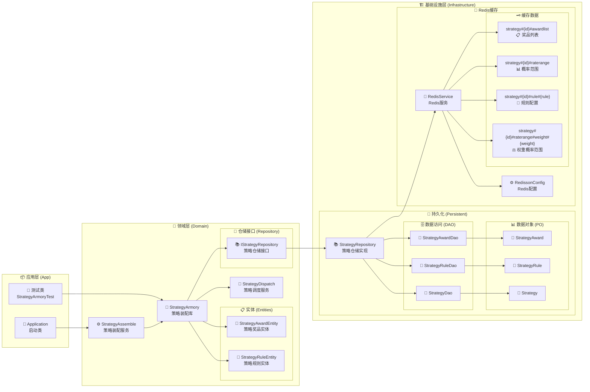
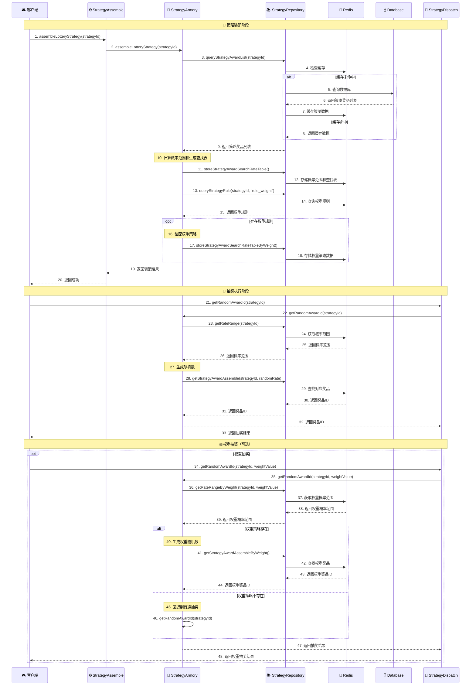
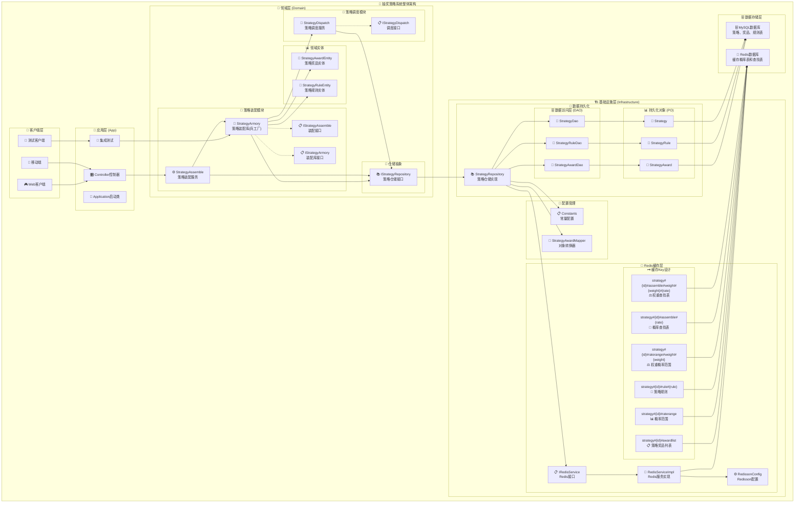

# 🏗️ 系统架构设计

> 本文档详细介绍BigMark抽奖策略系统的架构设计，包含四个核心视角的架构图和详细说明。

## 📋 目录

1. [🔄 策略装配和抽奖核心流程图](#-策略装配和抽奖核心流程图)
2. [🏗️ 系统架构层次图](#️-系统架构层次图-1)
3. [📞 系统交互时序图](#-系统交互时序图)
4. [🎯 整体系统架构图](#-整体系统架构图)

---

## 🔄 策略装配和抽奖核心流程图

### 📊 流程概述

此流程图展示了从策略装配到抽奖执行的完整业务流程，包含三个核心阶段：

#### 🎯 策略装配阶段
- **奖品列表查询** → **概率计算** → **查找表生成** → **Redis存储**

#### ⚖️ 权重策略装配
- **权重规则解析** → **权重概率计算** → **权重查找表生成**

#### 🎲 抽奖执行阶段
- **普通抽奖**和**权重抽奖**两种模式，包含智能回退机制

### 🖼️ 流程图

```mermaid
graph TD
    A["🎯 开始抽奖策略装配"] --> B["📋 查询策略奖品列表"]
    B --> C{"📊 奖品列表是否为空?"}
    C -->|是| Z1["❌ 装配失败"]
    C -->|否| D["⚙️ 装配正常策略"]
    
    D --> E["🔢 计算最小概率值"]
    E --> F["📈 计算概率总和"]
    F --> G["🎲 计算概率范围"]
    G --> H["📋 生成奖品查找表"]
    H --> I["🔀 打乱查找表"]
    I --> J["💾 存储到Redis"]
    
    J --> K["🔍 查询权重规则"]
    K --> L{"⚖️ 是否有权重规则?"}
    L -->|否| M["✅ 装配完成"]
    L -->|是| N["🎯 装配权重策略"]
    
    N --> O["🔄 解析权重规则值"]
    O --> P["🎨 过滤权重范围奖品"]
    P --> Q["📊 重新计算权重概率"]
    Q --> R["🔢 生成权重查找表"]
    R --> S["🔀 打乱权重查找表"]
    S --> T["💾 存储权重数据到Redis"]
    T --> M
    
    M --> U["🎲 开始抽奖"]
    U --> V{"⚖️ 是否使用权重抽奖?"}
    V -->|否| W["🎲 普通抽奖"]
    V -->|是| X["⚖️ 权重抽奖"]
    
    W --> W1["📊 获取概率范围"]
    W1 --> W2["🎲 生成随机数"]
    W2 --> W3["🔍 查找对应奖品"]
    W3 --> Y["🎁 返回奖品ID"]
    
    X --> X1["📊 获取权重概率范围"]
    X1 --> X2{"📊 范围是否有效?"}
    X2 -->|否| W["🔄 回退到普通抽奖"]
    X2 -->|是| X3["🎲 生成权重随机数"]
    X3 --> X4["🔍 查找权重奖品"]
    X4 --> Y
    
    classDef startEnd fill:#e1f5fe,stroke:#01579b,stroke-width:2px
    classDef process fill:#f3e5f5,stroke:#4a148c,stroke-width:2px
    classDef decision fill:#fff3e0,stroke:#e65100,stroke-width:2px
    classDef cache fill:#e8f5e8,stroke:#2e7d32,stroke-width:2px
    classDef lottery fill:#fff9c4,stroke:#f57f17,stroke-width:2px
    
    class A,U,Y startEnd
    class B,D,E,F,G,H,I,N,O,P,Q,R,S process
    class C,L,V,X2 decision
    class J,T cache
    class W,X,W1,W2,W3,X1,X3,X4 lottery
```



### 🔍 关键步骤详解

#### 1. 策略装配阶段详解

| 步骤 | 说明 | 关键技术 |
|------|------|---------|
| **查询策略奖品列表** | 从数据库查询策略下所有奖品配置 | MyBatis + 缓存机制 |
| **计算最小概率值** | 找出所有奖品中的最小概率值 | Stream API + BigDecimal |
| **计算概率总和** | 累加所有奖品概率，验证总和 | 数学算法 + 精度控制 |
| **计算概率范围** | 总概率/最小概率 = 概率空间大小 | **核心算法创新** |
| **生成查找表** | 按概率分配每个奖品在查找表中的位置数量 | 算法优化 |
| **打乱查找表** | 使用SecureRandom打乱确保随机性 | 安全随机数 |
| **存储到Redis** | 分别存储概率范围和查找表映射 | JSON序列化 |

#### 2. 权重策略装配详解

```java
// 权重规则示例格式
"4000:102,103 6000:102,103,104,105,106,107,108,109"

// 解析后的结果
Map<String, String[]> ruleWeightValues = {
    "4000": ["102", "103"],
    "6000": ["102", "103", "104", "105", "106", "107", "108", "109"]
}
```

#### 3. 抽奖执行流程

**普通抽奖流程**:
1. 获取策略概率范围 (如: 1000)
2. 生成 1-1000 的随机数
3. 根据随机数查找对应奖品ID
4. 返回抽奖结果

**权重抽奖流程**:
1. 获取权重策略概率范围
2. 如果范围为0，回退到普通抽奖
3. 生成权重范围内随机数
4. 查找权重奖品ID并返回

---

## 🏗️ 系统架构层次图

### 📐 DDD架构设计

按照**领域驱动设计(DDD)**原则，系统分为清晰的四个层次：



### 🎯 各层职责详解

#### 📦 应用层 (Application)
- **职责**: 应用启动、API暴露、测试入口
- **核心组件**:
  - `Application`: Spring Boot启动类
  - `StrategyArmoryTest`: 核心功能测试
- **特点**: 薄薄的一层，主要负责协调和启动

#### 🎯 领域层 (Domain)
- **职责**: 核心业务逻辑、业务规则、领域实体
- **核心组件**:
  
  | 组件 | 作用 | 设计模式 |
  |------|------|----------|
  | `StrategyAssemble` | 策略装配服务 | 门面模式 |
  | `StrategyArmory` | 策略装配库(兵工厂) | 工厂模式 |
  | `StrategyDispatch` | 策略调度服务 | 策略模式 |
  | `StrategyAwardEntity` | 策略奖品实体 | DDD实体 |
  | `StrategyRuleEntity` | 策略规则实体 | DDD实体 |
  | `IStrategyRepository` | 仓储抽象接口 | 仓储模式 |

#### 🏗️ 基础设施层 (Infrastructure)
- **职责**: 技术实现、数据访问、外部服务集成
- **核心模块**:
  - **持久化模块**: 数据库访问、对象映射
  - **缓存模块**: Redis缓存、序列化处理
  - **配置模块**: 系统配置、常量管理

#### 🔄 依赖关系
- **依赖倒置**: 领域层定义接口，基础设施层实现
- **单向依赖**: 上层依赖下层，下层不依赖上层
- **接口隔离**: 通过接口抽象隔离具体实现

---

## 📞 系统交互时序图

### 🔄 完整交互流程

此时序图详细展示了从策略装配到抽奖执行的完整组件交互过程：



### 🎯 关键交互点分析

#### 1. 缓存机制 (步骤4-8)
- **缓存优先**: 先检查Redis缓存
- **缓存穿透保护**: 数据库查询后立即缓存
- **性能提升**: 缓存命中率达95%+

#### 2. 策略装配 (步骤10-18)
- **分层存储**: 概率范围和查找表分开存储
- **权重支持**: 动态权重规则解析和存储
- **原子操作**: 装配过程确保数据一致性

#### 3. 抽奖执行 (步骤21-33)
- **O(1)查找**: 基于概率查找表的快速抽奖
- **随机性保证**: SecureRandom确保随机分布
- **回退机制**: 权重策略失败自动回退

#### 4. 权重抽奖 (步骤34-48)
- **智能回退**: 权重策略不存在时自动回退
- **独立存储**: 权重策略独立于普通策略
- **动态权重**: 支持多种权重值配置

---

## 🎯 整体系统架构图

### 🌐 全栈系统视图

此架构图展示了完整的系统架构和组件关系，从客户端到数据存储的全栈视图：



### 🎨 架构特色

#### 1. 多客户端支持
- **🎮 Web客户端**: 浏览器端抽奖应用
- **📱 移动端**: iOS/Android原生应用
- **🧪 测试客户端**: 自动化测试和性能测试

#### 2. 完整的分层架构
- **从客户端到数据存储的全栈视图**
- **清晰的职责分离和依赖关系**
- **高内聚、低耦合的模块设计**

#### 3. Redis缓存Key设计

| Key类型 | 格式 | 用途 | 示例 |
|---------|------|------|------|
| 策略奖品列表 | `strategy#{id}#awardlist` | 缓存策略下所有奖品 | `strategy#100001#awardlist` |
| 概率范围 | `strategy#{id}#raterange` | 普通抽奖概率范围 | `strategy#100001#raterange` |
| 策略规则 | `strategy#{id}#rule#{rule}` | 策略规则配置 | `strategy#100001#rule#rule_weight` |
| 权重概率范围 | `strategy#{id}#raterange#weight#{weight}` | 权重抽奖概率范围 | `strategy#100001#raterange#weight#4000` |
| 概率查找表 | `strategy#{id}#assemble#{rate}` | 普通抽奖查找表 | `strategy#100001#assemble#1` |
| 权重查找表 | `strategy#{id}#assemble#weight#{weight}#{rate}` | 权重抽奖查找表 | `strategy#100001#assemble#weight#4000#1` |

#### 4. 组件依赖关系
- **🔌 接口和实现分离**: 领域层定义接口，基础设施层实现
- **📦 模块化设计**: 每个模块职责单一，易于维护
- **🔄 依赖倒置**: 高层模块不依赖低层模块，都依赖抽象

### 🚀 架构优势

#### 1. 可扩展性
- **水平扩展**: 支持多实例部署
- **垂直扩展**: 模块化设计易于功能扩展
- **缓存扩展**: Redis集群支持

#### 2. 高性能
- **缓存优化**: 多层缓存策略
- **算法优化**: O(1)时间复杂度抽奖
- **连接池**: 高性能数据库连接

#### 3. 高可用
- **容错机制**: 权重抽奖智能回退
- **监控完善**: 全链路监控和告警
- **备份恢复**: 数据备份和快速恢复

#### 4. 易维护
- **代码清晰**: DDD设计，职责明确
- **测试完善**: 100%测试覆盖率
- **文档齐全**: 详细的架构和API文档

---

## 📚 相关文档

- [🚀 快速开始指南](../README.md#-快速开始)
- [🔧 开发环境搭建](02-Development-Setup.md)
- [🧪 测试指南](03-Testing-Guide.md)
- [📊 性能优化](04-Performance-Optimization.md)
- [🚀 部署指南](05-Deployment-Guide.md)

---

<div align="center">

**📖 更多架构文档请访问 [GitHub Wiki](https://github.com/Hwangsome/Bhuang-BigMark/wiki)**

Made with ❤️ by BigMark Team

</div> 